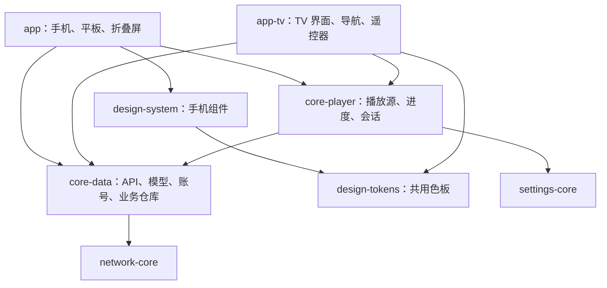

# BiliPai TV 适配实施记录

## 决策与边界

在当前 BiliPai 仓库新增 `:app-tv`，独立包名 `com.android.bilipai.tv`、独立安装包；不使用旧 TV 仓库。最低 Android 8.0，面向 Android TV、Google TV 和普通安卓盒子。手机与 TV 的界面、交互、凭据和本地偏好分别保存，服务端账号数据按各端登录的账号同步。

共享模块不依赖应用页面、导航、手机 ViewModel 或手机主题。共享代码中仍保留原 `com.android.purebilibili` 包名，以减少手机调用方迁移成本。诊断日志、API 错误上报和隐私设置通过 `CoreNetworkConfig` 注入；手机继续使用原来的日志及错误上报，TV 使用自己的配置。

## 本次实现范围

阶段一的代码骨架及纵向链路已实现，同时接入阶段二的部分页面。2026-10-02 用户明确要求启动 TV 虚拟机并执行脚本测试后，已生成并安装 TV Debug 包。当前适合进行基础观看原型验收；完整 TV 功能、视觉设计和兼容验收尚未完成。

| 能力 | 当前代码状态 |
| --- | --- |
| 独立 TV 应用 | TV 和普通启动入口、横屏、图标、Banner；触屏、摄像头和 Leanback 均非必需硬件 |
| 共用数据 | 网络客户端、响应模型、会话存储、搜索、收藏、历史、稍后再看仓库已迁移；手机改为依赖共享模块 |
| 共用播放 | DASH 清单与进度存储已迁移；APP 播放请求签名、观看心跳由两端调用同一实现 |
| TV 播放会话 | Media3、DASH/渐进式媒体源、暂停、进度、倍速、画质、分 P、结束后重播或下一 P、错误重试与手动 480P 回退 |
| 浏览链路 | 推荐 → 详情 → 播放 → 返回；列表按视频标识恢复焦点和滚动位置，分页保持当前焦点 |
| 搜索 | 系统输入法、搜索历史、热词、分页、空结果提示 |
| 账号 | 游客观看；TV 接口扫码、过期刷新、离开取消、已扫码提示、退出登录、失效后的重新登录入口 |
| 个人内容 | 历史、收藏夹及夹内视频、稍后再看；详情支持加入稍后再看 |
| 本地设置 | 默认画质、自动下一 P、暂停观看历史上报、清空搜索历史 |
| 续播 | 按 CID 存储进度；TV 记住最近观看的分 P；本地缺少进度时使用匹配 CID 的服务端进度 |
| 系统控制 | 已建立 MediaSession，支持媒体播放/暂停键；系统音量键不拦截 |
| 设计复用 | 将现有色板原样抽入 `:design-tokens`，手机通过原设计系统继续导出，TV 直接使用；深色文字、侧栏选中态、粉色焦点边框已统一 |

手机原有缓存、推荐合并、播放回退和高级播放器编排仍在手机端；本次未把手机播放器 ViewModel 整体搬入共享模块。后续按业务链路继续提取，抽取后两端调用同一实现。

## 遥控器约定

- 普通页面：方向键导航，确认激活，返回逐层退出；根栏目返回推荐，推荐页再返回交给系统。
- 控件隐藏：确认显示控件并聚焦播放按钮；左右开始预览跳转位置。
- 控件显示：方向键导航；进度条获得焦点后左右调整，确认提交，返回取消调整。
- 返回优先关闭弹窗，再取消进度调整，再隐藏控件，最后退出播放。
- 弹窗关闭后恢复打开它的按钮；失败状态聚焦重试入口。
- 独立播放/暂停键直接控制播放，音量键交给系统。

## 设计与动效复用

TV 已有可操作界面，仍是观看原型。颜色使用同一份既有定义，保持原包名、字段和数值；没有把手机组件包整体接入 TV。字体、间距、圆角和纯展示区域下一步在梳理依赖后逐项共用。导航、遥控器焦点、弹窗和播放操作仍由 TV 组件实现。

可优先接入短时焦点缩放、选中反馈、页面及控件淡入淡出；参考手机的运动曲线和节奏，TV 调整幅度和持续时间。当前已使用 Compose for TV 组件自带焦点反馈，尚未接入手机的自定义动效规范。不默认启用持续背景动画、重模糊或手机触摸拖拽动效。

现有静态矢量 Banner 可用于原型验收，正式品牌图后续完善。官方要求提供 16:9 Banner 和启动图标，可采用前景/背景分层的自适应资源：[Android TV 图标规范](https://developer.android.com/design/ui/tv/guides/system/tv-app-icon-guidelines)。应用内动效独立实现，不依赖桌面 Banner 播放动画。

TV 页面改动不会被手机调用。共享核心和设计定义仍是两端公共依赖，不能承诺所有共享修改对手机零影响；手机账号、推荐、播放及进度回归尚未验收。

## 检查与已有测试

可独立运行 `python3 scripts/check_tv_architecture.py`，无需 Gradle。检查模块依赖方向、手机运行时依赖、入口、非必需硬件、资源 XML 和共享声明重复问题。本次该检查及 `git diff --check` 通过。

另使用独立 Kotlin 语法解析器扫描本次涉及的代码，无新增语法诊断；旧文件中已有的解析器限制不作为类型检查结果。以上检查**不覆盖 Kotlin 类型、依赖解析、焦点运行行为或真实接口结果**。

已运行通过 10 项单元测试：

- `TvFocusPolicyTest`：条目重排、删除后的焦点回退、进度边界、分层返回。
- `PlaybackResumePolicyTest`：新分 P 从头播放、本地/服务端进度优先级、看完后重新进入、越界进度。
- `PlaybackStreamDataSourceTest`：TV/Android 凭据分别使用对应签名参数，保留分 P、画质和音轨语言。

`Television_4K`（Android 36，3840×2160）上运行通过 5 项隔离 UI 测试：

- `TvRemoteNavigationTest`：方向键和确认进入详情、返回后原卡片焦点、追加分页保持焦点、侧栏返回当前行（3 项）。
- `TvSearchInputTest`：实体 Enter 提交、向下移动到搜索按钮并确认提交（2 项）。

启动脚本为 `./scripts/launch_tv.sh`，默认只使用已有 APK；只有明确加 `--build` 才编译。遥控器脚本为 `python3 scripts/tv_smoke.py --device emulator-5554`，不调用 Gradle，使用 ADB 方向键和语义/焦点断言，生成报告到 `app-tv/build/outputs/tv-qa/`。真实接口错误或播放时钟不推进记为失败。脚本不会确认扫码、退出账号或更改收藏。

本轮真实接口测试全部通过：推荐 → 详情 → 播放时钟推进 → 媒体键暂停/继续 → 快进预览取消 → 分层返回 → 恢复原卡片焦点；设置弹窗关闭与焦点恢复；系统输入法输入并搜索；账号页进入与返回取消。报告为 `app-tv/build/outputs/tv-qa/20261002-acceptance-final/report.json`，隔离 UI 测试日志为同目录 `instrumentation.txt`。测试结束应用停留在推荐页。

这只证明当前原型在该虚拟机上的基础链路，不能作为完整 TV 验收结论。扫码成功、过期、画质切换、多 P、续播、网络恢复及 Android 8/普通盒子仍未验收。

## 后续阶段

### 阶段二：补齐完整观看闭环

下一项优先抽取弹幕读取与解析的依赖，复用现有 `:danmaku-engine`，增加 TV 弹幕开关和适合盒子的默认密度。随后完善音轨选择、播放过程中登录失效的恢复路径，以及各操作弹窗的焦点断言。当前扫码取消使用返回键，支持过期后手动刷新。

继续提取手机与 TV 都需要的播放请求及回退策略；手机的手势、弹窗、插件和全局导航仍通过端侧适配器处理。把已有共享逻辑测试逐步移到对应共享模块。

阶段二完成条件仍为：从登录、找视频到观看及续播，必要操作均能只用遥控器完成；手机账号、推荐、播放和进度行为保持一致。

### 阶段三：番剧、直播与个人内容

先做番剧追番、选集、续播和连续播放，再增加直播列表、关注及播放；扩展 UP 主空间、关注内容、点赞和收藏操作。评论先支持阅读与展开。当前不提供这些页面，也不以空按钮占位。

复用账号权限判断，统一展示权限、地区和内容不可用错误；番剧与直播的播放差异留在共享核心与端侧策略之间。

### 阶段四：性能与生态

现有 TV 播放会话只按设备声明的解码 MIME 类型筛选视频轨，并优先 AVC；尚未完成分辨率、帧率、内存和实际播放结果驱动的自动策略。继续加入失败自动回退、备用 CDN、图片预取与缓存预算、弹幕密度和低性能设备策略。

增加标准 Android TV 的“继续观看”桌面入口，并按盒子能力启用。手机选片后在 TV 播放和辅助输入另行设计配对与通信协议。两端保持独立发行，共享核心变更同时评估两端影响。

## 阶段验收项

| 范围 | 必须覆盖 |
| --- | --- |
| 焦点 | 首次加载、分页、刷新、条目删除、弹窗关闭、播放返回；连续按键不丢焦点 |
| 播放 | 多 P、画质、续播、网络中断、结束重播、再次进入；状态与进度一致 |
| 账号 | 游客、扫码成功、二维码过期、登录失效、退出登录 |
| 兼容 | Android 8+，1080p/4K，标准 TV 与普通盒子，有无鼠标键盘 |
| 手机回归 | 共享账号、推荐、播放接口、DASH 和进度行为 |

各阶段仍按上述链路完成验收后再判定完成。静态检查通过不会自动把阶段状态改为已验收。
